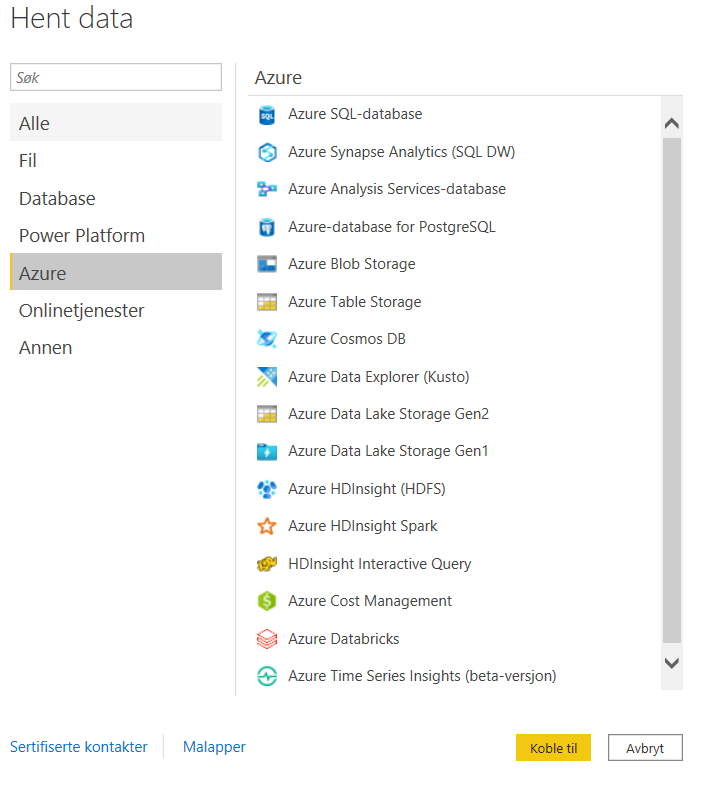
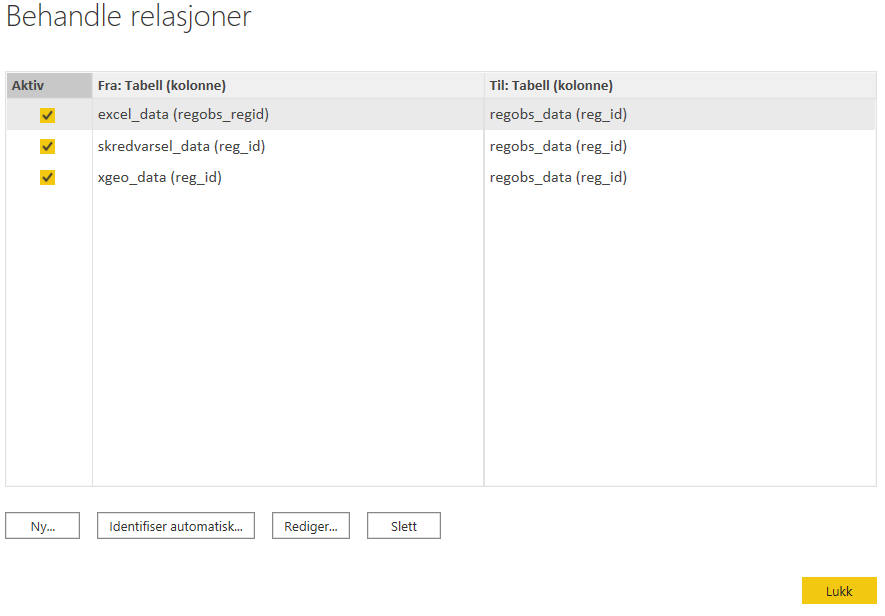
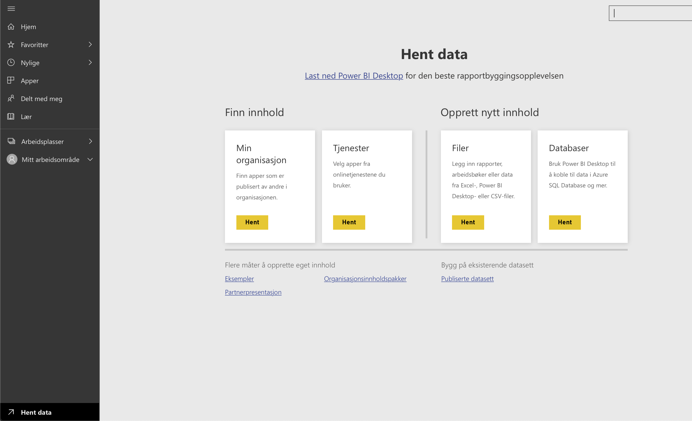

# PowerBI setup

## Hvordan legge til en datakilde
1. Åpne Power BI Desktop
2. I verktøylinjen; velg “Hent data”. Velg så riktig datakilde etterfulgt av “Koble til”. Azure SQL-database er hva som er blitt brukt til nå.

3.  Fyll inn servernavn og databasenavn i de to tilhørende feltene og huk av de boksene som vist på skjermbildet nedenfor. Trykk deretter på “OK”.

4. Man kan nå velge å laste inn dataen eller transformere dataen. Det anbefales å laste inn dataen for å se at den lastes inn riktig. Å transformere dataen kan enkelt gjøres også etter at dataen er lastet inn.

## Hvordan opprette en relasjon
1. For å definere relasjoner, gå til “Modell” i venstremargen. Se gul markering i skjermbildet nedenfor. 

2. Herfra kan man velge “Behandle relasjoner” fra den horisontale verktøylinjen.

3. I rullegardinene velges det hvilke to tabeller det skal opprettes en relasjon imellom. Power BI forsøker automatisk å velge hvilke to kolonner de to valgte tabellene skal matches opp på. I vedlagt skjermbilde har Power BI valgt reg_id som kolonne å matche opp på, hvilket er riktig. (mørk grå fyllfarge) Dette kan enkelt endres ved å klikke på ønsket kolonne. Velg så riktig kardinalitet og kryssfiltreringsretning, og huk av “Gjør denne relasjonen aktiv”. Klikk så på “OK”.

## Hvordan man får en Power BI-fil ut på nett (Del 1):
1. Start med å gå til https://app.powerbi.com og registrer bruker
2. Trykk på “Hent data” nede i venstre hjørnet, og velg “Hent” under Filer.

3. Finn frem til riktig fil ved å gå til riktig arbeidsområde, og enten gå til “Instrumentbord” eller “Rapporter”
4. Trykk deg deretter inn på filen.

5. Når alle ønskede endringer er gjort, og dashbordet er klart for å bli publisert på nett. **Se steg 9 for dette**, men først: Automatisk oppdatering. **Steg 6-8** tar for seg dette.

## Hvordan man setter opp automatisk oppdatering av dataen fra skyen inn i Power BI
6. Gå så tilbake til området vist på skjermbildet nedenfor. Velg så “Datasett”.

7. Trykk så på … nedenfor “HANDLINGER” og velg deretter “Innstilinger” fra nedtrekksmenyen som dukker opp.

8. Under “Planlagt oppdatering” setter man opp ønsket oppdateringsfrekvens og hvilke(t) tidspunkt på døgnet man ønsker å legge oppdateringen til.

## Hvordan man får en Power BI-fil ut på nett (Del 2):
9. Nå er dashbordet klart for å bli publisert på nett. For å gjøre dette må man gå tilbake til der man var i **steg 5**. Her trykker man “Fil” → “Publiser på nett”. Kopier HTML-kodesnutten.

… og lime inn som src i iframen du vil at dashbordet skal ligge i, f.eks i Wix:

10. Publiser nettsiden, og dashbordet er klart 🎉
